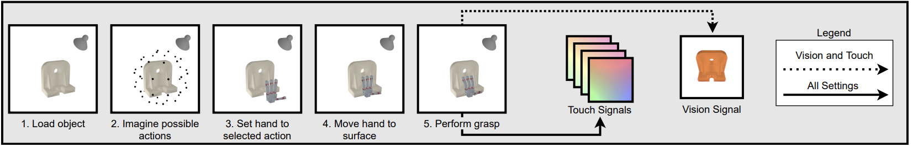
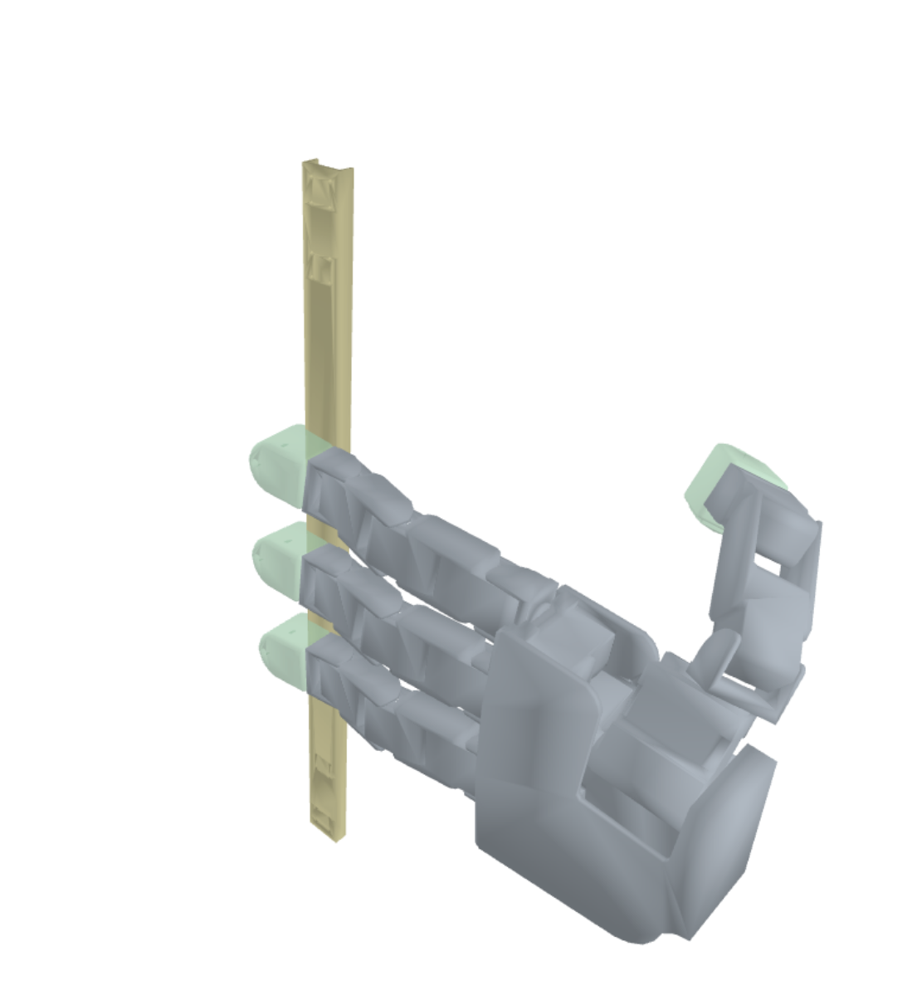

<!---
Copyright (c) Facebook, Inc. and its affiliates.
All rights reserved.
This source code is licensed under the license found in the
LICENSE file in the root directory of this source tree.
-->
## Active Vision and Touch
Companion code for [E.J. Smith, et al.: Active 3D Shape Reconstruction from Vision and Touch](https://arxiv.org/pdf/2107.09584.pdf).

This repository contains a simulator for extracting vision and touch signals from the interaction of a robotic hand and a large dataset of 3d shapes, 
and a code base and dataset for learning to select touch signals to optimally reconstruct 3D shapes from vision and touch.  
The code comes with pre-defined train/valid/test splits over the dataset released, pretrained models, and training and evaluation scripts.
 This code base uses a subset of the [ABC Dataset](https://deep-geometry.github.io/abc-dataset/) (released under MIT License).


<p align="center">
  
</p>

If you find this code useful in your research, please consider citing with the following BibTeX entry:

```
@article{smith2021active,
  title={Active 3D Shape Reconstruction from Vision and Touch},
  author={Smith, Edward J and Meger, David and Pineda, Luis and Calandra, Roberto and Malik, Jitendra and Romero, Adriana and Drozdzal, Michal},
  journal={arXiv preprint arXiv:2107.09584},
  year={2021}
}
```

### Installation

This code uses Python 3.8 , PyTorch 1.7.1, and PyTorch3D 0.5.0 . Here are the step I use to install this: 
```bash
conda create -n pytorch3d python=3.8
conda activate pytorch3d
conda install -c pytorch pytorch=1.7.1 torchvision cudatoolkit=10.2
conda install -c fvcore -c iopath -c conda-forge fvcore iopath
conda install -c bottler nvidiacub
conda install pytorch3d -c pytorch3d
```

If you are having trouble setting up this envrionment I recommend following the PyTorch3D installation code found [here](https://github.com/facebookresearch/pytorch3d/blob/main/INSTALL.md).  

- Install dependencies
```bash
$ pip install -r requirements.txt
```

- The package is called pterotactyl. To install call: 
```bash
$ python setup.py develop
```
- If you are having trouble rendering using pyrender it is very possibly that the update sugggested [here](https://github.com/mcfletch/pyopengl/issues/27) will solve your issue.

### Dataset
To download the dataset call the following, keep in mind this will take some time (~30 mins) to download and unpack:
```bash
$ bash download_data.sh
```

### Pretrained Models
If you wish to download pretrained models please call the following: 
```bash
$ bash download_models.sh
```

### Simulator
The simulator allows for touch signals and images of an object - hand grasp interaction to be rendered. 
<p align="center">
  
</p>

A simple example, performing an action grasp on an object in the simulator: 
```python
import os
from PIL import Image
from pterotactyl.simulator.scene import sampler
from pterotactyl.simulator.physics import grasping
import pterotactyl.objects as objects

OBJ_LOCATION = os.path.join(os.path.dirname(objects.__file__), "test_objects/0")
batch = [OBJ_LOCATION]
s = sampler.Sampler(grasping.Agnostic_Grasp, bs=1, vision=True, resolution = [256, 256])
s.load_objects(batch, from_dataset=False, scale = 2.6)

action = [30]
parameters = [[[.3, .3, .3], [60, 0, 135]]]
signals = s.sample(action, touch=True, touch_point_cloud=False, vision=True, vision_occluded=True,parameters=parameters )

img_vision_grasp = Image.fromarray(signals["vision_occluded"][0])
display(img_vision_grasp)

```
<p align="center">
  
</p>

```python
image = np.zeros((121*4, 121*2, 3)).astype(np.uint8)
for i in range(4):
    touch = signals["touch_signal"][0][i].data.numpy().astype(np.uint8)
    image[i*121:i*121+121, :121] = touch
    depth = utils.visualize_depth(signals["depths"][0][i].data.numpy()).reshape(121, 121, 1)
    image[i*121:i*121+121, 121:] = depth
print(' ')
print('     TOUCH         DEPTH')
display(Image.fromarray(image))
```
<p align="center">
  
</p>


More extensive examples are provided in the jupyter notebook at notebook/simulator.ipynb . 

### Reconstruction Models 
We provide a reconstruction model which predicts a mesh from vision and touch inputs, and also an auntoencoder which embeds these predictions in a small latent space. 
The training and eveluation code for these models are found at pterotactyl/reconstruction/. The touch folder converts touch signals to mesh charts, the vision folder predicts a full mesh prediction from vision signals, and predicted touch charts, and the autoencoder folder embeds the prediction in a latent space.  

Extensive examples for all models are provided in the jupyter notebooks at notebook/reconstruction.  
Pretrained models are provided for all of these reconstruction examples. 

### Policies
We provide baseline, oracle, and datadriven solutions for optimally selecting touch signals for 3D reconstruction. 
The and evaluation code for these models are found at pterotactyl/policies/. 

A simple example, testing the even baseline: 
```python
import os
from pterotactyl.reconstruction import touch 
from pterotactyl.reconstruction import vision 
from pterotactyl.policies.baselines import even
from pterotactyl import pretrained

TOUCH_LOCATION = os.path.dirname(pretrained.__file__) + '/reconstruction/touch/best/'
VISION_LOCATION = os.path.dirname(pretrained.__file__) + '/reconstruction/vision/v_t_p/'


class Params: # define training arguments 
    def __init__(self):
        
        self.limit_data = True
        self.env_batch_size = 2
        self.num_actions = 50
        self.seed = 0 
        self.budget = 5
        self.number_points = 10000
        self.loss_coeff = 9000
        self.exp_type = "even_v_t_p_example"
        self.finger = False 
        self.num_grasps = 5 
        self.use_touch = True 
        self.use_img = True
        self.touch_location = TOUCH_LOCATION
        self.vision_location = VISION_LOCATION
        self.visualize = True
        self.use_latent = False
        self.use_recon = True 
        self.eval = True 
        self.pretrained_recon = True
        
    

params = Params()
random_test = even.Engine(params)
random_test()
```

Extensive examples for all policies are provided in the jupyter notebook at notebook/policies.  
Pretrained models are provided for all Policies.

### Results 
We evaluate our learned policies in terms of % chamfer distance improvement after 5 touches.
In the following table we highight the performance of each policy over 5 models, in 4 learning settings:  
<p align="center">
  
</p>

### License
See [LICENSE](LICENSE.md) for details.
